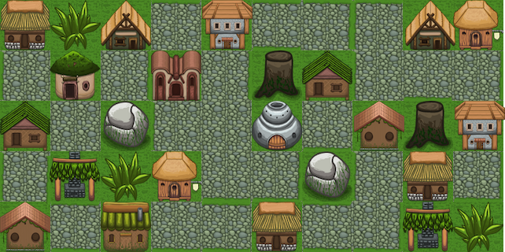

# Software Engineering Apprentice, 2020

> Please share a link to a sample of code you have written, highlight the piece of the code you are proud of. 

<br>

Recently, I worked with a classmate on building an RPG style game that used the Canvas element within React to build a layered game map off of a tile set.



<br>

While I had used Canvas with vanilla JS, it was difficult to translate into React because it required direct access to the DOM. Our solution was to build `MapComponent`, a class that initializes two instances of Canvas using `createRef()` and draws the game map based on a given array.

To see this in its full context, the entire file is [here](./mapComponent.js). To see the entire project repo, click [here](https://github.com/juliejonak/LambdaMUD-Client/blob/master/src/components/Map/Map.js) and to see the final deployed project, click [here](https://pedantic-poitras-604fab.netlify.com/).

<br>

```
/**
 * MapComponent is our instance of the MapCreator, used to dictate the size of the game board, individual tiles, and to create the layers of the graphical game board.
 * It initializes the canvas layers and draws the game board and sprite onto those canvases.
 */

class MapComponent extends Component {

    constructor(props) {
      super(props);

      this.state = {
        // Here we are setting the game board size in pixels
        width: 640,
        height: 320,
        // These store the current X and Y coordinates of the user's sprite
        userX: props.userX,
        userY: props.userY
      };

      // We used React.createRef() to hold two refs for accessing the DOM
      // One is used to build the world map in 3 layers, while the other creates the character sprite for navigating the game
      this.canvasRef = React.createRef();
      this.canvasRef2 = React.createRef();
    }


    /**
     * Update Map will update the current map by redrawing the 2 canvas refs
     * @params: none
     * returns none
     */

    updateMap() {

      const image = new Image();
      const userCharacter = new Image();
      image.src = tileMap;
      userCharacter.src = sprite;
      const ctx = this.canvasRef.current.getContext("2d");
      const ctx2 = this.canvasRef2.current.getContext("2d");
  

      // This function checks if the source image for both the tileset and sprite have loaded, only drawing the canvas afterwards to prevent errors

      const background = () => {
        return new Promise(resolve => {

          image.onload = () => {

            // Iterates over each of the 3 arrays in the game map array
            for (var i = 0; i < 3; i++) {

              // Iterates over the Map's columns
              for (var c = 0; c < Map.columns; c++) {

                // Iterates over the Map's rows
                for (var r = 0; r < Map.rows; r++) {

                  // For each tile, we grab the associated 64 pixel square on the tilemap artwork, to draw that onto the Canvas element to create the map

                  var tile = Map.getTile(i, c, r);

                  // If the tile is not blank, it will draw the indicated square
                  if (tile !== 0) {
                    ctx.drawImage(
                      image, // image
                      (tile - 1) * Map.tile_size, // source x
                      0, // source y
                      Map.tile_size, // source width
                      Map.tile_size, // source height
                      c * Map.tile_size, // target x
                      r * Map.tile_size, // target y
                      Map.tile_size, // target width
                      Map.tile_size // target height
                    );
                  }
                }
              }
            }
          };
          resolve("Done");
        });
      };
```